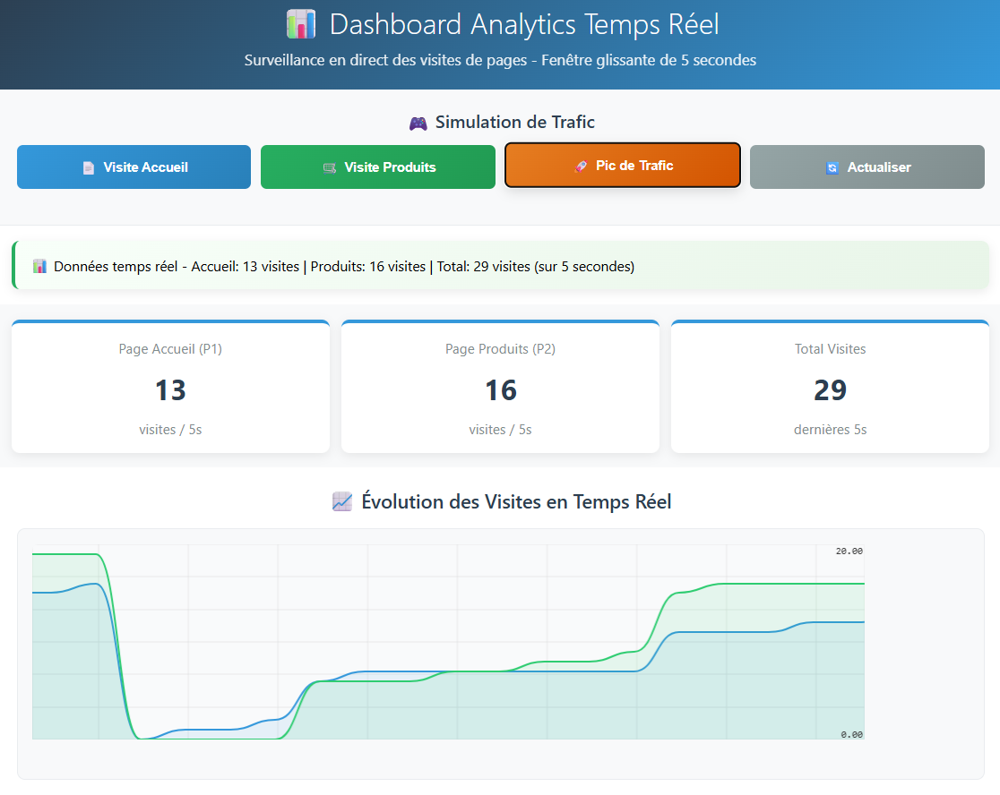

# 📊 Dashboard Analytics Temps Réel - Kafka

## 🎯 Objectif 
Développer un système de monitoring en temps réel qui affiche le nombre de visites des pages **P1 (Accueil)** et **P2 (Produits)** dans une **fenêtre glissante de 5 secondes** en utilisant **Kafka Streams** et **Spring Cloud Stream**.

## 📋 Fonctionnalités Principales

### ✅ Réalisées
- **Génération automatique** d'événements de visite
- **Traitement temps réel** avec Kafka Streams
- **Agrégation des données** sur une fenêtre de 5 secondes
- **Dashboard web** avec métriques en direct
- **Graphique temps réel** des visites
- **API REST** pour simulation manuelle

### 📁 Structure du Code
```
+---src
|   +---main
|   |   +---java
|   |   |   \---org
|   |   |       \---sid
|   |   |           \---kafkaspringcloudstream
|   |   |               |   KafkaSpringCloudStreamApplication.java
|   |   |               |
|   |   |               +---controllers
|   |   |               |       PageEventController.java
|   |   |               |
|   |   |               +---events
|   |   |               |       PageEvent.java
|   |   |               |
|   |   |               \---handlers
|   |   |                       PageEventHandler.java
|   |   |
|   |   \---resources
|   |       |   application.properties
|   |       |
|   |       +---static
|   |       |       index.html
|   |       |
|   |       \---templates

```
### 📈 Fonctionnement
1. Génération données : Le Supplier crée des événements de visite
2. Traitement Stream : Kafka Streams compte les visites sur 5s
3. Visualisation : Le dashboard affiche les métriques temps réel
4. Interaction : Boutons pour simuler du trafic manuel

## 🖼️ Captures d'Écran




### 🔧 Fonctionnement Détaillé
1. Génération des Données
```
// Supplier automatique générant P1/P2 aléatoirement
@Bean
public Supplier<PageEvent> pageEventSupplier() {
    return () -> new PageEvent(
        Math.random()>0.5?"P1":"P2",  // Page aléatoire
        Math.random()>0.5?"U1":"U2",  // Utilisateur aléatoire
        new Date(),                    // Timestamp
        randomDuration()              // Durée aléatoire
    );
}
```
2. Traitement Kafka Streams
```
@Bean
public Function<KStream<String, PageEvent>, KStream<String, Long>> kStreamFunction() {
    return input -> input
        .map((k,v) -> new KeyValue<>(v.name(), 1L))    // Transformation
        .groupByKey()                                  // Groupement par page
        .windowedBy(TimeWindows.of(Duration.ofSeconds(5))) // Fenêtre 5s
        .count()                                       // Comptage
        .toStream()
        .map((k,v) -> new KeyValue<>(k.key(), v));     // Formatage
}
```
3. Visualisation Temps Réel
```
// Connexion SSE pour données temps réel
var eventSource = new EventSource("/analytics");
eventSource.onmessage = function(event) {
    var data = JSON.parse(event.data);
    // Mise à jour du graphique et des métriques
    updateDashboard(data);
};
```
### 🚀 Guide d'Installation
1. Prérequis :
   
Java 17 ou supérieur

Apache Kafka (avec Zookeeper)

Maven 3.6+

2. Démarrer Kafka :
   
* Option 1: Avec Docker
  
docker-compose up -d
* Option 2: Manuellement
  
bin/zookeeper-server-start.sh config/zookeeper.properties

bin/kafka-server-start.sh config/server.properties

## 📚 Ressources & Documentation

### 📖 Documentation Officielle
- [**Spring Cloud Stream Documentation**](https://spring.io/projects/spring-cloud-stream)
  *Guide complet sur Spring Cloud Stream et l'intégration Kafka*

- [**Kafka Streams Documentation**](https://kafka.apache.org/documentation/streams/)
  *Documentation officielle Apache Kafka Streams*

- [**Smoothie.js Documentation**](https://github.com/joewalnes/smoothie)
  *Bibliothèque de graphiques temps réel pour JavaScript*

### 🔗 Liens Utiles
- [Spring Boot Reference Guide](https://docs.spring.io/spring-boot/docs/current/reference/html/)
- [Kafka Official Website](https://kafka.apache.org/)
- [MDN Web Docs - Server-Sent Events](https://developer.mozilla.org/en-US/docs/Web/API/Server-sent_events)

### 💌 Auteur

👩‍💻 **Rim Aaloi**  
💌 Contact: [GitHub Profile](https://github.com/RimAaloi) | [LinkedIn](https://www.linkedin.com/in/rim-aaloi/)  
